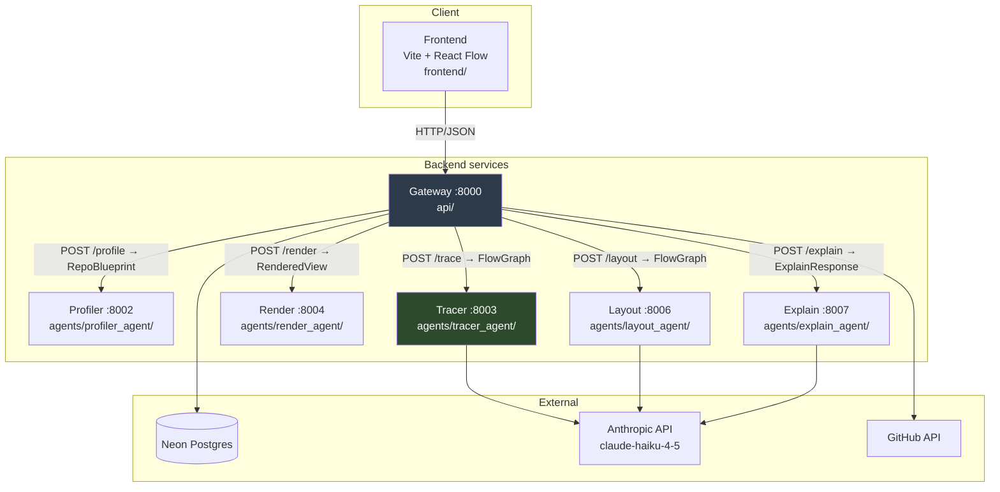

# 03 — The System As Built

Documentation of the delivered system at commit `b9779cf` (7 August 2026) plus the uncommitted
working tree. Measurements were taken on 8 August 2026.

---

## 3.1 Architecture

Six FastAPI services plus a React frontend. Each agent is an independent uvicorn app; the gateway
orchestrates and persists.



The tracer is shaded because it is the system: 213 of the 360 backend Python files and 9,063 of the
14,333 backend lines live in it.

### Service responsibilities

| Service | Port | Single responsibility | Input | Output |
|---|---|---|---|---|
| **Gateway** (`api/`) | 8000 | Orchestrate the pipeline, serve the UI's HTTP API, persist results, handle auth and GitHub | HTTP from frontend | `AnalyseResponse`, `RepoMapDetail`, `CodeResponse`, … |
| **Profiler** (`agents/profiler_agent/`) | 8002 | Repo module/zone skeleton | repo archive or local path | `RepoBlueprint` |
| **Tracer** (`agents/tracer_agent/`) | 8003 | Index, resolve, extract forks, judge, condense to a decision graph | `TracerRequest` | `FlowGraph` |
| **Layout** (`agents/layout_agent/`) | 8006 | Cosmetic labelling of the finished graph | `LayoutRequest{flow_graph}` | `LayoutResponse{flow_graph}` |
| **Render** (`agents/render_agent/`) | 8004 | Deterministic React Flow geometry | `RenderRequest{flow_graph}` | `RenderResponse{view}` |
| **Explain** (`agents/explain_agent/`) | 8007 | On-demand plain-English symbol summaries (fills the "frame") | `ExplainRequest` | `ExplainResponse` |
| **Frontend** (`frontend/`) | 5173 (Vite) | Thin renderer over backend-supplied positions; interaction | `RenderedView` | — |

**The explain agent is called by the gateway's `NodeExplainService`, never by the pipeline**, so it
costs nothing until a user opens a frame (`PROMPT.md` §Architecture). Results are cached by
content-addressed fingerprint in `ExplanationStore`.

### Key endpoints

Gateway (`api/routers/`):

```
POST /analyse                      POST /analyse/local
POST /analyse/github               POST /analyse/local/from-profile
GET  /analyse/stage-status         POST /analyse/local/from-trace
GET  /progress                     POST /analyse/local/from-layout
GET  /repomaps                     GET  /repomaps/{repo}
GET  /repomaps/{repo}/flow         POST /repomaps/{repo}/explain
GET  /code                         GET  /diagram/edits    PUT /diagram/edits
POST /auth/login  /auth/signup  /auth/callback  /auth/link
GET  /tokens  POST /tokens  DELETE /tokens/{id}
GET  /github/repos   GET /github/my-repos
```

The `from-profile` / `from-trace` / `from-layout` variants exist to resume a pipeline from a
completed stage — supporting the progress-bar resume feature (PBI-48).

Agents expose exactly one endpoint each: `POST /profile`, `POST /trace`, `POST /layout`,
`POST /render`, `POST /explain`.

---

## 3.2 Tech stack

Versions from the active virtualenv and `frontend/package.json`.

| Component | Version | Source |
|---|---|---|
| Python | **3.10.17** | `venv/bin/python --version` |
| FastAPI | 0.135.3 | `pip show` |
| Pydantic | 2.12.5 | `pip show` |
| Uvicorn | 0.44.0 | `pip show` |
| Anthropic SDK | 0.89.0 | `pip show` |
| Model | `claude-haiku-4-5-20251001`, temperature 0 | `llm_decision_judge.py:_MODEL` |
| Persistence | `psycopg[binary]` + `psycopg-pool` → Neon Postgres | `requirements.txt` |
| Auth | `bcrypt`, `python-multipart` | `requirements.txt` |
| Other | `httpx`, `pydantic-settings`, `python-dotenv`, `a2a-sdk`, `tree-sitter`, `networkx` | `requirements.txt` |
| React | ^18.3.1 | `frontend/package.json` |
| React Flow (`reactflow`) | ^11.11.4 | `frontend/package.json` |
| Vite | ^4.5.14 | `frontend/package.json` |
| MUI | ^5.15.20 (+ `@mui/x-charts` ^6.19.8) | `frontend/package.json` |
| React Router | ^6.23.1 | `frontend/package.json` |
| Playwright | dev-only, uses installed Chrome via `channel="chrome"` | `requirements-dev.txt` |

**Dependency count:** 13 direct runtime Python dependencies; 10 direct frontend dependencies plus 2
dev.

**Dead weight.** Three declared Python dependencies appear unused by the current pipeline:
`tree-sitter` and `networkx` (both introduced for the `pyan3`/`jarviscg` era — the current resolver
uses the stdlib `ast` module and hand-rolled SCC condensation in `scc_index_builder.py`), and
`a2a-sdk`. `pip uninstall`-and-run would confirm. Removing them is cosmetic but worth mentioning as
housekeeping the project has not done.

**Differences from the interim report:** `NOT MEASURABLE FROM REPO`. The interim report on disk
(`~/Documents/Uni/Year_4/TR2/Honours_Project/Interim_Report.docx`) contains only the literature review
(§3.1–3.6, 4,512 words) and states no tech stack. The complete submission is presumably
`~/Downloads/40595321.pdf`, which has no text-extraction tool on this machine. Run
`brew install poppler` to make it readable.

The one difference that can be asserted with confidence, because it is documented in the repository
itself: **JARVIS is no longer used.** The interim report's literature review discusses JARVIS at nine
points and motivates its adoption; `jarviscg` was removed from `requirements.txt` at `774102a`
(16 July 2026). See `01_evolution.md` §1.2(g).

---

## 3.3 Data contracts

Full field-by-field listings are in `06_appendices.md`. Summary of what crosses each boundary:

### `ProfileResponse` — gateway ← profiler

`shared/models/profiler_response.py` is a **one-line alias**: `ProfileResponse = RepoBlueprint`.

```
RepoBlueprint:
  architecture_type: str
  language: str
  framework: str
  patterns: list[str]
  modules: list[ModulePlan]
      ModulePlan{ name, description, root_path, style, is_service,
                  zones: list[ZonePlan{ name, description, directories }] }
```

### `FlowGraph` — the live pipeline contract

`shared/models/flow_graph.py`. Produced by the tracer, passed through layout and render unchanged in
structure. **This is the schema that matters** — it carries the decision graph.

```
FlowGraph{ repo, page_title, lanes, nodes, edges, meta }
  FlowNode{ id, kind ∈ [entry|step|decision|parallel|effect|outcome], lane, label,
            llm_label, one_liner, backing, refs: [SourceRef{file, line, end_line}],
            badges ∈ [loop|recursive|dynamic|guarded|folded], folded_count,
            effect_kind ∈ [http_out|database|llm|file|queue|email|response], effect_target,
            level, hidden_children, owner_fqn, arm_path, containers,
            body_kind ∈ [flow|list], body_head, body_tails }
  FlowEdge{ source, target, kind ∈ [sequence|arm|parallel|stitch], arm_label, llm_label,
            group_id, confidence ∈ [resolved|inferred|dynamic], is_spine, hidden_path }
  Lane{ id, name, llm_title, entry_ids, mass }
```

`FlowGraph` **sorts itself canonically on validation** — a `model_validator(mode="after")` sorts
nodes by `id` and edges by a seven-field tuple. This is a load-bearing part of the determinism
guarantee: it means byte-identical output does not depend on dictionary iteration order anywhere
upstream.

The separation of `label` (source-derived) from `llm_label` (model-written) is the mechanism that
enforces "the LLM may never rewire anything" — the model writes into a different field from the one
structure depends on.

### `LayoutResponse` / `RenderResponse`

```
LayoutRequest { flow_graph: FlowGraph }   →  LayoutResponse { flow_graph: FlowGraph }
RenderRequest { flow_graph: FlowGraph }   →  RenderResponse { view: RenderedView }

RenderedView{ type, page_title, nodes: list[dict], edges: list[dict],
              hidden: list[dict], hidden_edges: list[dict],
              node_geometry: dict[str, dict[str, int]] }
```

`RenderedView.nodes` and `.edges` are untyped `list[dict]` — React Flow node objects passed straight
through. This is the one place the project trades schema safety for convenience.

### `DiagramSpec` — superseded, still present

`shared/models/diagram_spec.py` (86 lines) defines `Component`, `ComponentIO`, `Edge`,
`ExternalActor`, `Cluster`, `ZoneClusterPlan`, `Module`, `LayoutHint`, `DiagramSpec`. **It is not on
the live path** — no current pipeline stage produces or consumes it. It survives because
`shared/models/diagram_template.py` imports `ComponentTier` and `EdgeType` from it.

Its own evolution is visible by comparing it to the April output recovered in
`02_decision_algorithm.md` §2.1: the April spec grouped components under `layers`
(`presentation`/`business`/`data`); the current definition replaces that with `modules` →
`zones` → `cluster_plan`, and adds `role`, `tier`, `nested`, `start_line`, `end_line` and
`layout_hint`. The three-tier assumption was removed; the file itself then became dead.

---

## 3.4 Frontend

101 source files, 4,838 lines of JS/JSX. Structure:

```
frontend/src/
  pages/          FlowPage.jsx (95 lines) and siblings
  components/
    flow/         FlowCanvas, NodeChrome, CameraController, ExpandToggle, IsolateButton
      nodes/      EntryNode, StepNode, DecisionNode, EffectNode, OutcomeNode,
                  ParallelNode, PipelineNode, GroupBox
      isolate/    IsolatedChrome, FrameContent, SymbolList, ViewToggle,
                  FlowchartView + 7 flowchart* helpers (untracked)
    diagram/      legacy diagram view, edit mode, nodes/
    dashboard/, settings/
  hooks/          useExpansion, useIsolatedView, useNodeExplanation, useDiagramEdits, …
    graph/        overlayReducer, common
  theme/          ThemeModeContext (light/dark)
  api/
```

### Drill-down behaviour and thresholds

The frontend is a **thin renderer**: positions come from the render agent, not from dagre or any
client-side layout. What the frontend owns is expansion state and camera.

- A node displays a `+N` control when `hidden_children` is non-empty; `N` is that list's length.
- Pressing `+` reveals exactly `hidden_children`, which the backend has already topologically sorted.
- `body_kind` decides the reveal shape: `"flow"` chains members sequentially from `body_head` to
  `body_tails`; `"list"` lays them out as a set of alternatives.
- Nesting is unbounded in principle — measured depth on `django-helpdesk` reaches **level 8**.

The thresholds themselves are **backend constants**, not frontend ones (`budget_config.py`):
`skeleton_budget = 15` always-visible nodes, `max_reveal_per_node = 8` per `+`, `max_body = 6`,
`max_arms_per_decision = 5`. The design intent is stated in `CLAUDE.md`: *"a `+` that reveals 50
nodes at once is a bug, not disclosure."*

### The frame (isolate)

Clicking a revealed node's `isolate` control transforms **that node** into a large rectangle at ~92%
of the canvas — not a panel or modal. `NodeChrome` renders the control only when `data.depth > 0`.
The frame shows the node's title, `file:line`, the resolved class or function, and its methods with
one-line summaries; its right column toggles between a code view and a flowchart view.

Content is fetched on demand from `POST /repomaps/{repo}/explain` and cached, so explanations are
never generated for every node up front. `flow_graph.meta.symbol_context` (written by
`SymbolContextBuilder`) carries each node's owning FQN and function/class table so the explain agent
can be handed only the source slices it needs.

Animation timings, which the test harness must respect: ~920 ms frame open plus a 760 ms camera pan;
`FlowSession.isolate` waits 1,300 ms.

---

## 3.5 Codebase metrics

Measured 8 August 2026 at `b9779cf` plus working tree.

| Area | Files | Lines |
|---|---|---|
| `agents/tracer_agent` | 213 | 9,063 |
| `api` | 47 | 2,014 |
| `scripts` | 17 | 1,395 |
| `shared` | 30 | 954 |
| `agents/render_agent` | 22 | 788 |
| `agents/profiler_agent` | 19 | 651 |
| `agents/explain_agent` | 22 | 458 |
| `agents/layout_agent` | 17 | 363 |
| **Backend total** | **387** | **15,686** |
| `frontend/src` (JS/JSX) | 101* | 4,838 |
| **Total** | **488** | **20,524** |

\* 101 counts `.jsx`, `.js` and `.css`; the 4,838-line figure counts `.jsx` and `.js` only.

The tracer is **58% of backend lines across 55% of backend files** — appropriate, since it is where
the contribution lives, and consistent with the design principle that structure is computed rather
than generated.

### Compliance self-audit against `CLAUDE.md`

`CLAUDE.md` imposes: max 150 lines per file, type annotations on all signatures, constructor
injection only, one class per file, SOLID, no inline comments, no unused imports.

**Max 150 lines — one violation in the entire codebase.**

```
$ find agents api shared scripts -name '*.py' -exec wc -l {} + | awk '$1>150'
     266 api/dependencies.py
```

Every other backend Python file, and every frontend JS/JSX file, is at or under 150 lines
(the largest frontend files are `useIsolatedView.js` and `EditToolbar.jsx` at exactly 150).

`api/dependencies.py` at 266 lines is the wiring composition root — the one place where
constructor injection necessarily concentrates, since it is where every concretion is
constructed. That is a defensible exception in principle, but it is **not** a documented one:
`CLAUDE.md` states the limit without a composition-root carve-out, so by the project's own rule it
is a violation. It is also the single most likely place for the rule to be breached, which the
project appears not to have anticipated when writing the rule.

**Constructor injection.** Followed consistently. Every service in
`agents/tracer_agent/services/analysis/` takes its collaborators in `__init__`; factories
(`*_factory.py`, 11 of them) do the construction. There is no service locator and no module-level
mutable state.

**Configuration discipline.** `CLAUDE.md` documents a serious past failure: four factories read
`os.environ` directly and silently fell back to offline heuristics under uvicorn, producing 22 nodes
where the scripts produced 394 — "with no error anywhere". The current rule is that config comes
through `Settings` and is passed as a parameter. Spot-checking `decision_judge_factory.py` and
`flow_namer_factory.py` confirms they now take the key as an argument.

**One class per file.** Followed. The 213 tracer files for ~9,000 lines is a direct consequence —
a mean of 43 lines per file.

**Honest observation on the rule set.** The 150-line limit and one-class-per-file rule are followed
almost perfectly, but they produce a codebase of 213 files in a single directory
(`services/analysis/`). Whether that aids or harms comprehension is a fair question for the
evaluation chapter, and it is somewhat ironic for a project whose thesis is that structural
enumeration is a poor substitute for understanding.

---

## 3.6 Built but not shipped; shipped but not planned

### Built, not on the live path

| Thing | Status |
|---|---|
| `shared/models/diagram_spec.py` | 86 lines, no producer or consumer; survives only for two type aliases |
| `shared/models/diagram_template.py` — `DiagramTemplate`, `TemplateNode`, `TemplateEdge`, the 9-value `DiagramType` | Only `RenderedView` from this file is used |
| `frontend/src/components/diagram/` | The pre-pivot diagram view and edit mode; superseded by `components/flow/` |
| Diagram edit mode (PBIs 38–47) | Endpoints (`GET`/`PUT /diagram/edits`), Neon store, overlay merge, `TextNode`, `EditToolbar` all exist; built against the old diagram view |
| `tree-sitter`, `networkx`, `a2a-sdk` | Declared dependencies, no apparent current use |
| `docker-compose.yml` | **0 bytes** |
| `README.md` | **10 bytes** |

### Shipped, not in the interim report's seven objectives

- **The decision algorithm itself.** The largest single contribution is not among the seven
  objectives — objective 2 describes JARVIS + LLM reasoning, which is what it replaced.
- **The explain agent and the frame** (service 6, port 8007). On-demand symbol explanation with
  content-addressed caching.
- **User accounts and per-user persistence** — signup/login, bcrypt hashing, API tokens, Neon
  `repo_maps` storage, GitHub OAuth and repository picker.
- **CI/CD** — `.github/workflows/cd.yml` builds six images and runs `railway redeploy` on push to
  `main`.
- **The agent-driven test harness** — `flow_agent.py` drives the real page in headless Chrome and
  reports state as assertable text; `flow_metrics.py` checks structural invariants;
  `screenshot_flow.py` renders to PNG; `selfrun.py` runs in-process self-analysis. This is
  substantial engineering (1,395 lines in `scripts/`) and is good LO3 evidence.
- **Light/dark theming** (PBIs 53–54).

---

## Gaps and open questions

1. **Interim-report version comparison is impossible from the repository.** See §3.2. Requires
   `brew install poppler` and the PDF.
2. **`docker-compose.yml` and `README.md` are effectively empty** (0 and 10 bytes). A marker
   assessing professional practice (LO1/LO3) will likely open both. This is cheap to fix and worth
   fixing before submission.
3. **Unused-dependency claim is inferential.** `tree-sitter`, `networkx` and `a2a-sdk` show no
   imports in the current tracer path, but this was checked by grep, not by removing them and running
   the suite.
4. **No test suite exists.** `CLAUDE.md` forbids unsolicited tests, and the project relies on
   `flow_metrics.py`, `selfrun.py` and `flow_agent.py` instead. That is a defensible and unusual
   choice which the dissertation should defend explicitly rather than leave a marker to notice.
   The harness checks structural invariants and rendered geometry, not unit behaviour.
5. **Frontend line count excludes CSS.** 4,838 lines covers `.jsx`/`.js` only; `isolate.css` and
   siblings are not counted.
6. **Port 8005 is unallocated** — agents use 8002, 8003, 8004, 8006, 8007. Probably a removed
   service; not investigated.
